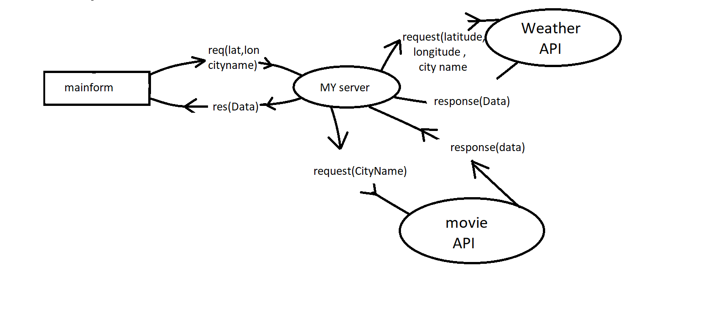

# CITY_EXPLORER-API

## Working Flow:

**Author**: Walaa' Atiah

## Overview
**The user can search for any city he wants and shows him some information about it:**

* city's coordinates . Details of the city’s location. And the city’s location on the map
* forcasted weather conditions for the upcoming 16 days
*  movies with the same city name.

## Getting Started
* the user should put the city's name that want to search about it and click in submitt button .
 

* The application sends a request to the "LocationIQ API",which it sends the coordinates of the city and some information that the app analyze and send the  coordinates and city name local server, which in turn sends a request to “weatherAPI”and "Movie API" which send weather details and some movies related to the city's name 

## Architecture
use :
* javascrept 
* css 
* html
* react application 
* react-bootstrap library
* locationiq libray
* axios library 
* weather API 
* Movie API
* heroku .com  -for back end -
* app.netlify.com -for front end

## Credit and Collaborations
me and Amani AL-Zoube designed the working Working Flow 