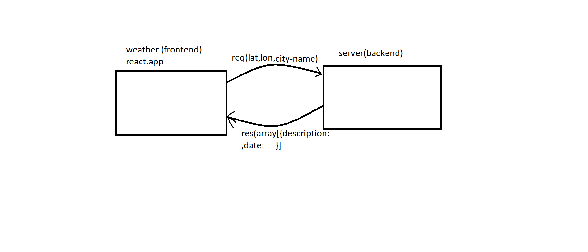

# city-explorer-api
# CITY_EXPLORER

my partner is Amani al-zooubi

**Author**: Walaa' Atiah

**Version**: 1.0.0 (increment the patch/fix version number if you make more commits past your first submission)

## Overview
* creat API server for the weather 
the user send requst have lattude longuted and city name 
the the APIserver respons the discreption for weather and the datetime 
 
## Getting Started
* the user should put the city's name that want to search about it and click in submitt button 

## Architecture
use :
* javascrept 
* css 
* html
* react-bootstrap library
* locationiq libray
* app.netlify.com
* axios library 
* heroku .com 
* 

## Change Log

## Credit and Collaborations
[locationiq](https://locationiq.com/)

[react-bootstrap](https://react-bootstrap.netlify.app/utilities/ratio/)

[trello](https://trello.com/b/yTlkP3uE/asynchronous-code-and-apis)

[netlify](https://app.netlify.com/teams/walaaatiah97/overview)

Name of feature: Asynchronous code, and APIs

Estimate of time needed to complete: _____

Start time: 2.00pm

Finish time: 11.00pm

Actual time needed to complete: 8 hours